# arXiv Benchmarks

This directory holds the reproducible arXiv benchmark harness for TexSoup and a
few relevant comparison tools. The canonical entry point is
`benchmarks/arxiv.py`.

## Usage

Benchmark the default backend set on one or more arXiv source packages:

```bash
python3 benchmarks/arxiv.py 2004.05565 1706.03762 1512.03385 --repeats 3 --warmups 1
```

Restrict the run to a subset of backends:

```bash
python3 benchmarks/arxiv.py 2004.05565 --backends texsoup latexwalker plastex
```

Run external converters without a timeout:

```bash
python3 benchmarks/arxiv.py 2004.05565 --backends latexml --command-timeout-seconds 0
```

The script:

- downloads the arXiv `e-print` source package
- safely extracts the source tree
- picks the most likely top-level `.tex` file
- expands common `\input` and `\include` patterns
- optionally inlines `.bbl` content
- runs each backend on the same expanded source text

## Backends

- `texsoup`: TexSoup itself
- `latexwalker`: `pylatexenc`'s syntax walker
- `plastex`: `plasTeX`
- `latexml`: LaTeXML
- `latex2html`: latex2html

These are intentionally lumped together in one harness, but they are not doing
the exact same job. `latexwalker` is a lightweight syntax walker, while
`latexml` and `latex2html` are full document converters.

## Results



This larger snapshot compares TexSoup, plasTeX, and LaTeXML on a 50-paper
AI/ML arXiv set. The robustness panel breaks outcomes into successes,
timeouts, and other failures, and the speed panel reports mean runtime on
successful papers only.

The 50-paper chart uses a `10` second timeout for all tools, and the speed
panel reports the mean of per-paper median runtimes on successful papers only.
The TexSoup numbers below were refreshed on April 8, 2026 using `5` timed runs
after `1` warmup; the plasTeX and LaTeXML columns remain from the previous
snapshot. Paper titles are linked and truncated for readability.

| Backend | Success Rate | Mean Time |
| --- | ---: | ---: |
| TexSoup | `50/50` | `668 ms` on successes |
| plasTeX | `11/50` | `829 ms` on successes |
| LaTeXML | `29/50` | `5,231 ms` on successes |

## 50-Paper Raw Results

| Paper | Title | Chars | TexSoup | plasTeX | LaTeXML |
| --- | --- | ---: | ---: | ---: | ---: |
| [1706.03762](https://arxiv.org/abs/1706.03762) | [Attention Is All You Ne…](https://arxiv.org/abs/1706.03762) | `73,870` | `368 ms` | `fail` | `4839 ms` |
| [1810.04805](https://arxiv.org/abs/1810.04805) | [BERT: Pre-training of D…](https://arxiv.org/abs/1810.04805) | `85,622` | `494 ms` | `1599 ms` | `timeout` |
| [1512.03385](https://arxiv.org/abs/1512.03385) | [Deep Residual Learning…](https://arxiv.org/abs/1512.03385) | `78,331` | `999 ms` | `812 ms` | `timeout` |
| [1409.1556](https://arxiv.org/abs/1409.1556) | [Very Deep Convolutional…](https://arxiv.org/abs/1409.1556) | `71,509` | `1302 ms` | `fail` | `5143 ms` |
| [1406.2661](https://arxiv.org/abs/1406.2661) | [Generative Adversarial…](https://arxiv.org/abs/1406.2661) | `49,699` | `984 ms` | `timeout` | `4300 ms` |
| [1312.6114](https://arxiv.org/abs/1312.6114) | [Auto-Encoding Variation…](https://arxiv.org/abs/1312.6114) | `51,535` | `1165 ms` | `fail` | `timeout` |
| [2004.05565](https://arxiv.org/abs/2004.05565) | [FBNetV2: Differentiable…](https://arxiv.org/abs/2004.05565) | `53,962` | `814 ms` | `timeout` | `4534 ms` |
| [2006.02049](https://arxiv.org/abs/2006.02049) | [FBNetV3: Joint Architec…](https://arxiv.org/abs/2006.02049) | `72,438` | `1333 ms` | `fail` | `5991 ms` |
| [2004.00221](https://arxiv.org/abs/2004.00221) | [NBDT: Neural-Backed Dec…](https://arxiv.org/abs/2004.00221) | `78,325` | `508 ms` | `fail` | `fail` |
| [2103.00020](https://arxiv.org/abs/2103.00020) | [Learning Transferable V…](https://arxiv.org/abs/2103.00020) | `252,082` | `1724 ms` | `fail` | `timeout` |
| [2010.11929](https://arxiv.org/abs/2010.11929) | [An Image is Worth 16x16…](https://arxiv.org/abs/2010.11929) | `82,089` | `513 ms` | `fail` | `fail` |
| [2303.08774](https://arxiv.org/abs/2303.08774) | [GPT-4 Technical Report](https://arxiv.org/abs/2303.08774) | `124,947` | `610 ms` | `507 ms` | `timeout` |
| [1905.11946](https://arxiv.org/abs/1905.11946) | [EfficientNet: Rethinkin…](https://arxiv.org/abs/1905.11946) | `63,805` | `387 ms` | `fail` | `4664 ms` |
| [1908.09791](https://arxiv.org/abs/1908.09791) | [Once-for-All: Train One…](https://arxiv.org/abs/1908.09791) | `58,817` | `362 ms` | `fail` | `fail` |
| [1905.02244](https://arxiv.org/abs/1905.02244) | [Searching for MobileNet…](https://arxiv.org/abs/1905.02244) | `64,484` | `729 ms` | `timeout` | `4915 ms` |
| [1801.04381](https://arxiv.org/abs/1801.04381) | [MobileNetV2: Inverted R…](https://arxiv.org/abs/1801.04381) | `75,774` | `767 ms` | `fail` | `5568 ms` |
| [1704.04861](https://arxiv.org/abs/1704.04861) | [MobileNets: Efficient C…](https://arxiv.org/abs/1704.04861) | `51,317` | `338 ms` | `fail` | `4122 ms` |
| [1608.06993](https://arxiv.org/abs/1608.06993) | [Densely Connected Convo…](https://arxiv.org/abs/1608.06993) | `77,726` | `968 ms` | `fail` | `4063 ms` |
| [1512.02325](https://arxiv.org/abs/1512.02325) | [SSD: Single Shot MultiB…](https://arxiv.org/abs/1512.02325) | `66,067` | `781 ms` | `1276 ms` | `4523 ms` |
| [1506.01497](https://arxiv.org/abs/1506.01497) | [Faster R-CNN: Towards R…](https://arxiv.org/abs/1506.01497) | `76,206` | `863 ms` | `fail` | `8008 ms` |
| [1506.02640](https://arxiv.org/abs/1506.02640) | [You Only Look Once: Uni…](https://arxiv.org/abs/1506.02640) | `58,295` | `642 ms` | `fail` | `4752 ms` |
| [1703.06870](https://arxiv.org/abs/1703.06870) | [Mask R-CNN](https://arxiv.org/abs/1703.06870) | `72,928` | `975 ms` | `timeout` | `8761 ms` |
| [1612.03144](https://arxiv.org/abs/1612.03144) | [Feature Pyramid Network…](https://arxiv.org/abs/1612.03144) | `60,386` | `754 ms` | `timeout` | `9296 ms` |
| [1708.02002](https://arxiv.org/abs/1708.02002) | [Focal Loss for Dense Ob…](https://arxiv.org/abs/1708.02002) | `63,902` | `805 ms` | `timeout` | `8292 ms` |
| [1709.01507](https://arxiv.org/abs/1709.01507) | [Squeeze-and-Excitation…](https://arxiv.org/abs/1709.01507) | `84,505` | `1143 ms` | `306 ms` | `6218 ms` |
| [1511.08458](https://arxiv.org/abs/1511.08458) | [An Introduction to Conv…](https://arxiv.org/abs/1511.08458) | `29,311` | `238 ms` | `1356 ms` | `timeout` |
| [1505.04597](https://arxiv.org/abs/1505.04597) | [U-Net: Convolutional Ne…](https://arxiv.org/abs/1505.04597) | `25,168` | `120 ms` | `fail` | `2521 ms` |
| [1312.5602](https://arxiv.org/abs/1312.5602) | [Playing Atari with Deep…](https://arxiv.org/abs/1312.5602) | `63,103` | `367 ms` | `fail` | `4410 ms` |
| [1509.02971](https://arxiv.org/abs/1509.02971) | [Continuous control with…](https://arxiv.org/abs/1509.02971) | `56,329` | `479 ms` | `fail` | `4845 ms` |
| [1707.06347](https://arxiv.org/abs/1707.06347) | [Proximal Policy Optimiz…](https://arxiv.org/abs/1707.06347) | `220` | `2 ms` | `606 ms` | `1684 ms` |
| [1802.05365](https://arxiv.org/abs/1802.05365) | [Deep contextualized wor…](https://arxiv.org/abs/1802.05365) | `96,706` | `637 ms` | `1205 ms` | `5253 ms` |
| [1907.11692](https://arxiv.org/abs/1907.11692) | [RoBERTa: A Robustly Opt…](https://arxiv.org/abs/1907.11692) | `48,059` | `304 ms` | `fail` | `timeout` |
| [1910.10683](https://arxiv.org/abs/1910.10683) | [Exploring the Limits of…](https://arxiv.org/abs/1910.10683) | `267,488` | `1499 ms` | `timeout` | `fail` |
| [1909.11942](https://arxiv.org/abs/1909.11942) | [ALBERT: A Lite BERT for…](https://arxiv.org/abs/1909.11942) | `74,016` | `445 ms` | `fail` | `fail` |
| [2003.10555](https://arxiv.org/abs/2003.10555) | [ELECTRA: Pre-training T…](https://arxiv.org/abs/2003.10555) | `81,025` | `416 ms` | `fail` | `6913 ms` |
| [2002.04745](https://arxiv.org/abs/2002.04745) | [On Layer Normalization…](https://arxiv.org/abs/2002.04745) | `91,201` | `705 ms` | `fail` | `timeout` |
| [1804.02767](https://arxiv.org/abs/1804.02767) | [YOLOv3: An Incremental…](https://arxiv.org/abs/1804.02767) | `15,660` | `86 ms` | `timeout` | `2565 ms` |
| [1605.07146](https://arxiv.org/abs/1605.07146) | [Wide Residual Networks](https://arxiv.org/abs/1605.07146) | `50,810` | `257 ms` | `fail` | `4394 ms` |
| [1607.06450](https://arxiv.org/abs/1607.06450) | [Layer Normalization](https://arxiv.org/abs/1607.06450) | `57,796` | `366 ms` | `fail` | `fail` |
| [1609.03499](https://arxiv.org/abs/1609.03499) | [WaveNet: A Generative M…](https://arxiv.org/abs/1609.03499) | `44,649` | `231 ms` | `fail` | `4054 ms` |
| [2006.11239](https://arxiv.org/abs/2006.11239) | [Denoising Diffusion Pro…](https://arxiv.org/abs/2006.11239) | `86,175` | `576 ms` | `488 ms` | `timeout` |
| [2010.02502](https://arxiv.org/abs/2010.02502) | [Denoising Diffusion Imp…](https://arxiv.org/abs/2010.02502) | `82,089` | `682 ms` | `fail` | `fail` |
| [2106.08254](https://arxiv.org/abs/2106.08254) | [BEiT: BERT Pre-Training…](https://arxiv.org/abs/2106.08254) | `74,190` | `565 ms` | `462 ms` | `timeout` |
| [2012.12877](https://arxiv.org/abs/2012.12877) | [Training data-efficient…](https://arxiv.org/abs/2012.12877) | `58,706` | `378 ms` | `fail` | `timeout` |
| [2201.03545](https://arxiv.org/abs/2201.03545) | [A ConvNet for the 2020s](https://arxiv.org/abs/2201.03545) | `95,601` | `825 ms` | `fail` | `timeout` |
| [2111.06377](https://arxiv.org/abs/2111.06377) | [Masked Autoencoders Are…](https://arxiv.org/abs/2111.06377) | `86,386` | `644 ms` | `fail` | `8948 ms` |
| [2002.05709](https://arxiv.org/abs/2002.05709) | [A Simple Framework for…](https://arxiv.org/abs/2002.05709) | `105,789` | `868 ms` | `fail` | `timeout` |
| [2006.10029](https://arxiv.org/abs/2006.10029) | [Big Self-Supervised Mod…](https://arxiv.org/abs/2006.10029) | `80,661` | `461 ms` | `505 ms` | `5773 ms` |
| [2104.14294](https://arxiv.org/abs/2104.14294) | [Emerging Properties in…](https://arxiv.org/abs/2104.14294) | `18,696` | `126 ms` | `timeout` | `2340 ms` |
| [2112.10752](https://arxiv.org/abs/2112.10752) | [High-Resolution Image S…](https://arxiv.org/abs/2112.10752) | `211,624` | `1803 ms` | `fail` | `timeout` |

## Notes

- TexSoup parsed all `50/50` papers in this batch.
- plasTeX finished `11/50` papers: `9` timed out and `30` failed before the timeout.
- LaTeXML finished `29/50` papers: `14` timed out and `7` failed before the timeout.
- The speed panel intentionally reports successful-paper runtimes only; otherwise,
  plasTeX and LaTeXML timeout behavior would dominate the chart.

## Failure Notes

- Most LaTeXML failures in this 50-paper batch were practical `10` second timeouts
  rather than hard converter crashes.
- Most plasTeX failures were hard parse/runtime errors rather than timeouts.
